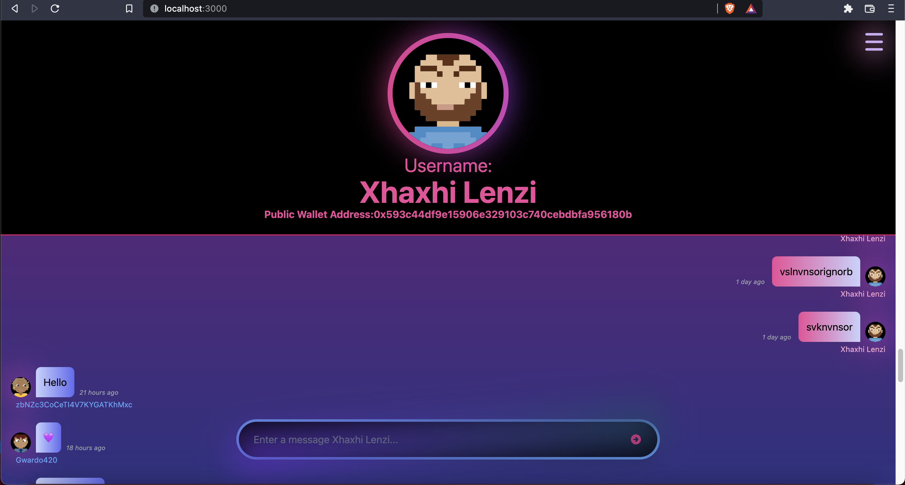

# Chat application

This is a Papafam challenge/project, that I built, in which I used react for building a chat app and Moralis to store the off-chain-data and handle the login/authentication of the user. No more usernames, emails, passwords... you just need a Metamask Wallet to sign in.

## Preview

## Built With

- [NextJS](https://nextjs.org/) - The React Framework
  for Production.
  - Authentication flow with Twitter API using NextAuth
  - Server Side Rendering
  - Create API backend endpoints
- [TailwindCSS](https://tailwindcss.com/) - Rapidly build modern websites without ever leaving your HTML
- [Javascript](https://www.typescriptlang.org/) - TypeScript is JavaScript with syntax for types.
  Intuitive SDKs and widgets for developers.
- [Moralis](https://www.moralis.io/) - Moralis provides a single workflow for building high performance dapps. Fully compatible with your favorite web3 tools and services.

---
## Deployed with Vercel

Deployed the build using [Vercel](https://vercel.com?utm_source=github&utm_medium=readme&utm_campaign=next-example):
